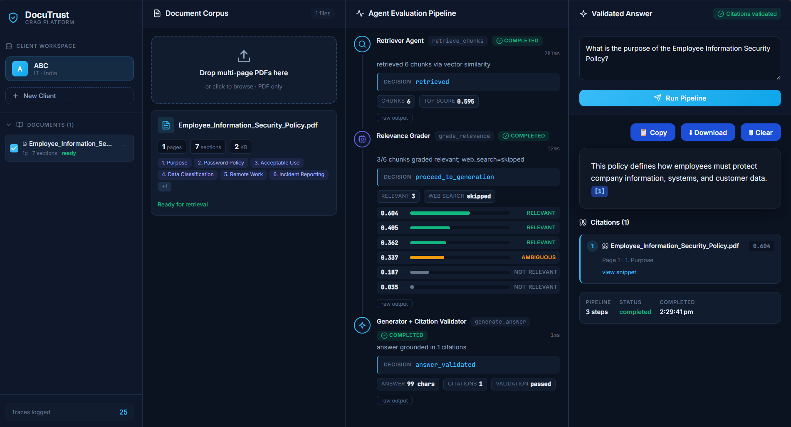
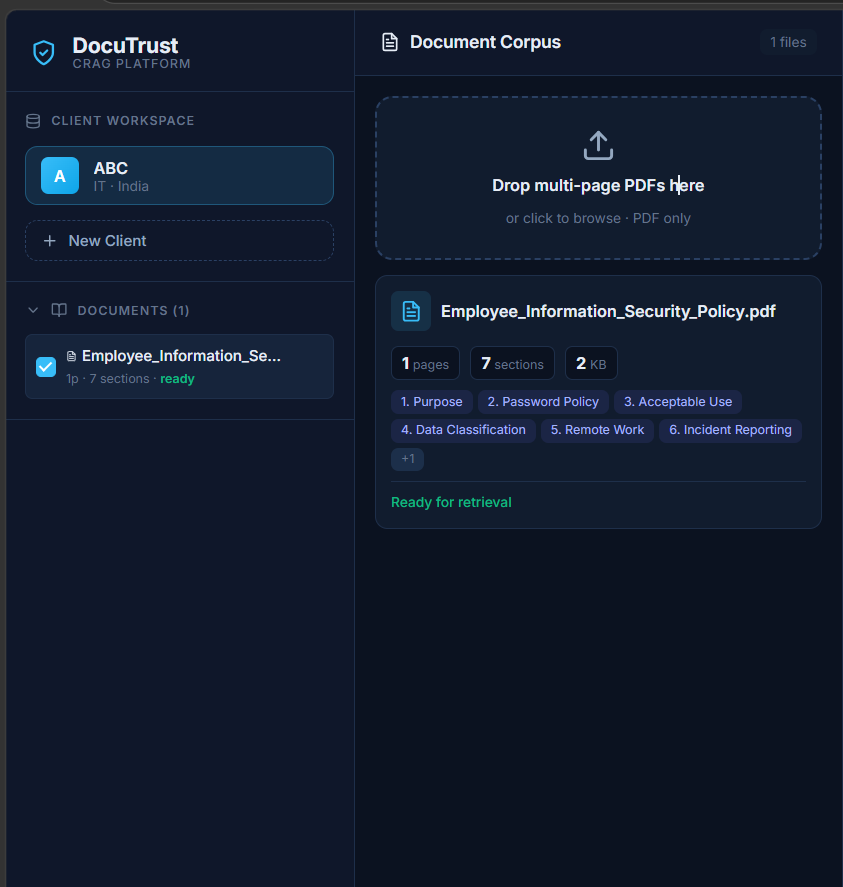
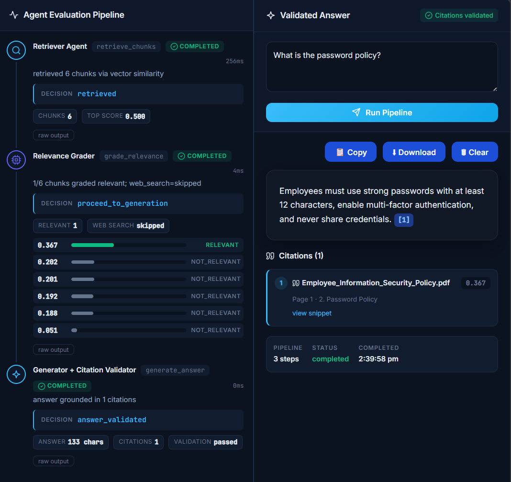

<div align="center">

```
██████╗  ██████╗  ██████╗██╗   ██╗████████╗██████╗ ██╗   ██╗███████╗████████╗
██╔══██╗██╔═══██╗██╔════╝██║   ██║╚══██╔══╝██╔══██╗██║   ██║██╔════╝╚══██╔══╝
██║  ██║██║   ██║██║     ██║   ██║   ██║   ██████╔╝██║   ██║███████╗   ██║   
██║  ██║██║   ██║██║     ██║   ██║   ██║   ██╔══██╗██║   ██║╚════██║   ██║   
██████╔╝╚██████╔╝╚██████╗╚██████╔╝   ██║   ██║  ██║╚██████╔╝███████║   ██║   
╚═════╝  ╚═════╝  ╚═════╝ ╚═════╝    ╚═╝   ╚═╝  ╚═╝ ╚═════╝ ╚══════╝   ╚═╝   
```

### *Where Documents Meet Intelligence*

[](https://github.com/ritikatripathi11111)
[](https://github.com/ritikatripathi11111)
[](https://reactjs.org/)
[](https://fastapi.tiangolo.com/)
[](https://www.mongodb.com/)
[](https://www.python.org/)

> **DocuTrust** is not just another RAG app.  
> It *thinks before it answers* — validating, grading, and correcting retrieval in real-time  
> so every response you get is one you can actually trust.

</div>

---

## ⚡ The Problem With Ordinary RAG

Most document Q&A systems retrieve chunks, stuff them into a prompt, and hope for the best.  
They hallucinate. They miss context. They give you confident-sounding wrong answers.

**DocuTrust is different.**

It uses **Corrective RAG (CRAG)** — a self-aware pipeline that *grades its own retrieval*, rewrites bad queries, falls back to the web when needed, and validates every citation before showing you a single word.

---

## 🧠 How the CRAG Pipeline Works

```
                        ╔══════════════════╗
                        ║    User Query    ║
                        ╚════════╤═════════╝
                                 │
                                 ▼
                      ┌──────────────────────┐
                      │   🔍 Retriever Agent  │
                      │  (Semantic Search)    │
                      └──────────┬───────────┘
                                 │
                                 ▼
                      ┌──────────────────────┐
                      │  🎯 Relevance Grader  │
                      │  Semantic + Keyword   │
                      └──────┬──────────┬────┘
                             │          │
               ┌─────────────┘          └───────────────┐
               ▼                                        ▼
   ┌───────────────────────┐            ┌───────────────────────────┐
   │  ✅ Relevant Chunks   │            │   ❌ No Relevant Chunks    │
   └───────────┬───────────┘            └──────────────┬────────────┘
               │                                       │
               ▼                                       ▼
   ┌───────────────────────┐            ┌───────────────────────────┐
   │  🤖 Generator Agent   │            │   ✏️  Query Rewriter       │
   └───────────┬───────────┘            └──────────────┬────────────┘
               │                                       │
               ▼                                       ▼
   ┌───────────────────────┐            ┌───────────────────────────┐
   │  🔗 Citation Validator│            │  🌐 Web Search Fallback   │
   └───────────┬───────────┘            └──────────────┬────────────┘
               │                                       │
               └──────────────────┬────────────────────┘
                                  │
                                  ▼
                       ╔══════════════════╗
                       ║ Validated Answer ║
                       ║  with Citations  ║
                       ╚══════════════════╝
```

**No hallucinations. No blind retrieval. Just trust.**

---

## ✨ Feature Highlights

| Feature | Description |
|---|---|
| 📄 **PDF Upload & Management** | Upload any policy or knowledge document |
| 🏢 **Multi-Client Workspaces** | Isolated environments per organization |
| 🧩 **Smart Document Chunking** | Intelligent splitting that preserves context |
| 🔍 **Vector Semantic Retrieval** | Finds meaning, not just keywords |
| 🎯 **Relevance Grading** | Self-evaluates chunk quality before generation |
| 🤖 **AI Answer Generation** | Grounded, accurate, explainable responses |
| ✅ **Citation Validation** | Every claim traced back to a source |
| 📚 **Source Snippets** | Page numbers, sections — full traceability |
| 🌐 **Web Fallback** | Automatically searches the web when docs fall short |
| 📊 **Pipeline Visualization** | Watch the CRAG pipeline execute in real time |
| 📋 **Copy & Download Answers** | Export results instantly |

---

## 🖼️ Screenshots

<details>
<summary><b>📸 Click to expand screenshots</b></summary>

### 🏠 Dashboard


### 📤 Document Upload


### 🔍 Retriever + Relevance Grader in Action


### ✅ Validated Answer with Citations


### 🔐 Password Policy Query Example


</details>

---

## ⚙️ Tech Stack

```
┌─────────────────────────────────────────────────────────┐
│                       DOCUTRUST                         │
├──────────────────────┬──────────────────────────────────┤
│      FRONTEND        │           BACKEND                │
│  ─────────────────   │   ──────────────────────────     │
│  React               │   FastAPI (Python)               │
│  TypeScript          │   MongoDB                        │
│  Vite                │   Vector Similarity Search       │
│  CSS                 │   Local Embedding Model          │
│                      │   Relevance Grader               │
│                      │   Citation Validator             │
│                      │   Query Rewriter                 │
│                      │   Web Search Fallback            │
│                      │   CRAG Architecture              │
└──────────────────────┴──────────────────────────────────┘
```

---

## 📂 Project Structure

```
docutrust/
│
├── 🗂️  backend/
│   ├── app/
│   │   ├── 🤖 agents/          ← CRAG pipeline agents
│   │   ├── 🌐 api/             ← REST endpoints
│   │   ├── ⚙️  core/           ← Configuration & settings
│   │   ├── 📦 models/          ← Data models
│   │   ├── 🔧 services/        ← Business logic
│   │   └── 🚀 main.py          ← FastAPI app entry point
│   │
│   ├── scripts/
│   └── requirements.txt
│
├── 🎨 frontend/
│   ├── src/
│   │   ├── 🧩 components/      ← UI components
│   │   ├── 🎨 styles/          ← CSS stylesheets
│   │   ├── 📚 lib/             ← Utility functions
│   │   └── 📱 App.tsx          ← Root component
│   │
│   ├── package.json
│   └── vite.config.ts
│
├── 📸 screenshots/
├── 📖 README.md
└── 🔒 .gitignore
```

---

## 🚀 Getting Started

### 1. Clone the Repository

```bash
git clone https://github.com/ritikatripathi11111/docutrust.git
cd docutrust
```

### 2. Start the Backend

```bash
cd backend
pip install -r requirements.txt
python -m uvicorn app.main:app --reload --host 0.0.0.0 --port 8001
```

### 3. Start the Frontend

```bash
cd frontend
npm install
npm run dev
```

> 🎉 Open your browser and navigate to `http://localhost:5173`

---

## 🧪 Try It Out — Sample Queries

Once running, upload any company policy PDF and ask:

```
💬 "What is the purpose of the Employee Information Security Policy?"
💬 "What is the password policy?"
💬 "Explain the acceptable use policy."
💬 "What is the remote work policy?"
💬 "What happens if the policy is violated?"
💬 "What is the incident reporting process?"
💬 "What are the compliance requirements?"
```

Watch the CRAG pipeline grade, rewrite, and validate — live.

---

## ✅ Version 1 — What's Built

- [x] Multi-client workspace
- [x] PDF upload & management
- [x] Intelligent document chunking
- [x] Embedding generation
- [x] Semantic retrieval
- [x] Relevance grading
- [x] Citation validation
- [x] AI answer generation
- [x] Query rewriting
- [x] Web search fallback
- [x] Live pipeline visualization
- [x] Copy & download answers

---

## 🔮 Version 2 — What's Coming

```
🔐  Authentication & RBAC            🔄  Streaming Responses
📊  Hybrid Retrieval (BM25 + Dense)  💬  Chat History & Memory
🎯  Cross-Encoder Re-ranking         📈  Analytics Dashboard
🧠  Multi-Document Reasoning         🌡️  Confidence Visualization
📷  OCR + Image/Table Understanding  🌍  Multi-Language Querying
🐳  Docker & Kubernetes Deployment   ☁️  Cloud Storage Integration
🤖  LLM Provider Selection           🧪  Feedback Learning Loop
```

---

## 👩‍💻 Author

<div align="center">

**Ritika Tripathi**  
B.Tech Computer Science Engineering (2023–2027)  
*AI • Machine Learning • Full Stack Development*

[](https://github.com/ritikatripathi11111)

</div>

---

<div align="center">

**If DocuTrust saved you from a hallucinated answer today, give it a ⭐**  
*Built with precision. Validated with trust.*

</div>
